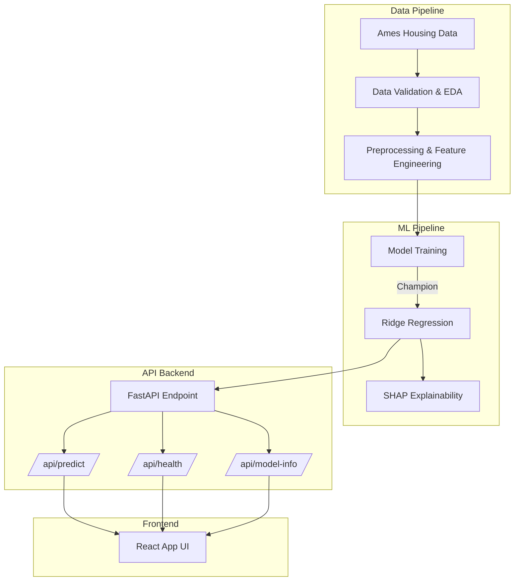
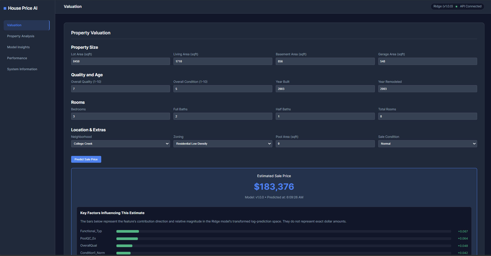

# House Price Intelligence System

## 1. Project Overview
This project is an end-to-end regression system for predicting residential sale prices. It demonstrates strong statistical reasoning, feature engineering, machine learning lifecycle management, and API development.

## 2. Business Problem
Real estate valuation requires balancing interpretability and accuracy. This system provides a robust automated valuation model (AVM) while ensuring predictions are explainable and transparent.

## 3. Why Ames Housing
The Ames dataset offers a rich array of features (79 variables) describing nearly every aspect of residential homes, making it a perfect case study for advanced regression techniques.

## 4. ML Problem Formulation
- **Target**: SalePrice
- **Task**: Supervised Regression
- **Objective**: Minimize RMSE in the original price space.

## 5. Target Distribution and Log Transformation
Housing prices are inherently right-skewed due to a few very expensive properties. We applied a `log1p` transformation to `SalePrice`:
- **Skewness Before**: 1.88
- **Skewness After**: 0.12
This stabilizes variance and reduces the leverage of extreme outliers.

## 6. Multicollinearity (VIF)
VIF was used to detect multicollinearity. Features like `GrLivArea` (VIF ~41) and `TotRmsAbvGrd` (VIF ~73) show high collinearity, typical in housing data (more rooms mean larger area).

## 7. Preprocessing Architecture
We built scikit-learn `Pipeline` and `ColumnTransformer` to handle:
- Imputation (Median for numerical, Most Frequent for categorical)
- Scaling (StandardScaler)
- Encoding (OneHotEncoder)

## 8. Models Compared
1. Ridge Regression
2. Lasso Regression
3. Random Forest Regressor
4. Gradient Boosting Regressor

## 9. Evaluation Methodology
Models were evaluated using 3-fold cross-validation and hyperparameter tuning (`GridSearchCV`). Final metrics (RMSE, MAE, R2) are reported on a holdout test set in the original price space using `expm1`.

## 10. Actual Model Results
- **Ridge**: RMSE=25053.84, MAE=16415.17, R2=0.9182
- **Lasso**: RMSE=25156.00, MAE=16332.02, R2=0.9175
- **RandomForest**: RMSE=28750.83, MAE=17581.10, R2=0.8922
- **GradientBoosting**: RMSE=28950.07, MAE=16794.65, R2=0.8907

## 11. Interpretability vs Accuracy
The Ridge model outperformed tree ensembles here. Linear models are highly interpretable natively, while Ensembles capture complex non-linearities but require SHAP for interpretability.

## 12. Explainability
We use SHAP (SHapley Additive exPlanations) to interpret feature impact globally. For local predictions in the application interface, we employ two distinct methodologies:

* **Model-Based Contribution Explanation**: We extract the actual learned `Ridge` coefficients and the individual transformed feature vectors to calculate the *real* log-space contribution of each feature towards the final prediction. This guarantees that the UI visualizers represent exactly how the linear model mathematically arrived at its estimate.
* **Rule-Based Descriptive Analysis**: Separately from the model's reasoning, the UI provides a deterministic "Property Profile Summary" (e.g., identifying "Older Construction" based on the year built). This is purely descriptive profiling and does not inject fake heuristics or false dollar bonuses into the model's mathematical output.

## 13. System Architecture
- **Data/Modeling**: Pandas, Scikit-Learn, SHAP
- **Backend API**: FastAPI, Pydantic
- **Containerization**: Docker, Docker Compose
- **CI/CD**: GitHub Actions



## 14. Screenshots


## 15. API Endpoints
- `GET /api/health`
- `GET /api/model-info`
- `POST /api/predict`

## 15. Local Setup
```bash
python -m venv venv
source venv/bin/activate
pip install -r requirements.txt
python src/data/ingest.py
python src/data/eda.py
python src/models/train.py
python src/models/explain.py
uvicorn backend.app.main:app --reload
```

## 16. Docker Setup
```bash
docker-compose up --build
```

## 17. License
This project is licensed under the MIT License - see the [LICENSE](LICENSE) file for details.
